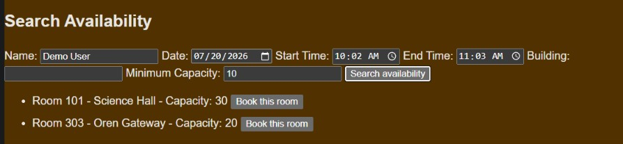
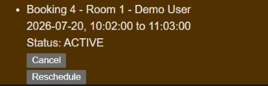
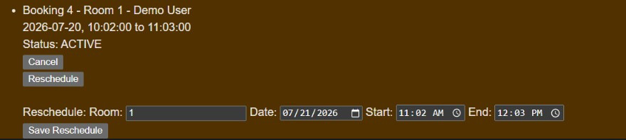

# Campus Room Booking Platform

Campus Room Booking Platform is a full-stack Spring Boot application for searching available campus rooms, creating bookings, and managing booking lifecycle actions with PostgreSQL persistence.

The project demonstrates more than basic CRUD: it includes layered backend architecture, validation, conflict prevention, soft cancellation, rescheduling rules, database-backed persistence, service/controller tests, and a browser UI served by Spring Boot.

## Demo Overview

A user can run the app locally, open the browser UI, search for available rooms, create a booking, view existing bookings, cancel an active booking, and reschedule a booking.

Typical demo flow:

1. Start PostgreSQL with Docker Compose.
2. Run the Spring Boot app.
3. Open `http://localhost:8080/`.
4. View seeded rooms and bookings.
5. Search available rooms for a date/time range.
6. Create a booking from an available room.
7. Confirm the bookings list updates.
8. Cancel or reschedule an existing booking.
9. Try an overlapping booking and see the backend reject the conflict.

## Demo Screenshots

### Search Available Rooms



### Booking Created



### Reschedule Booking



### Canceled Booking Status


## Features

### Browser UI

* View campus rooms
* View existing bookings
* Search for available rooms by date and time
* Filter availability by building and minimum capacity
* Create bookings from available room results
* Cancel active bookings
* Reschedule bookings
* Display loading, success, empty, and error states from backend responses

### Backend API

* List rooms
* Look up rooms by ID
* Filter rooms by building and minimum capacity
* Search room availability
* Create bookings
* List and filter bookings
* Look up bookings by ID
* Cancel bookings without deleting database records
* Reschedule bookings
* Validate request bodies and request parameters
* Return consistent error responses
* Persist rooms and bookings with PostgreSQL

## Tech Stack

* Java 25
* Spring Boot 4
* Maven
* PostgreSQL
* Docker Compose
* Spring Data JPA
* Bean Validation
* JUnit
* MockMvc
* HTML
* CSS
* JavaScript
* Git / GitHub

## Architecture

The application uses a layered architecture:

* **Controller**: handles HTTP requests and maps service results to HTTP responses
* **Service**: owns business rules and application workflows
* **Repository**: owns persistence and data access
* **Entity**: represents database tables for JPA
* **Model**: represents internal domain concepts
* **DTO**: defines API request and response shapes

Controllers do not talk directly to repositories. Business rules such as time validation, room existence checks, conflict prevention, cancellation behavior, and rescheduling behavior live in the service layer.

JPA entities stay inside the persistence layer and do not leak into API responses. API responses are returned through DTOs.

The frontend is intentionally simple and served from Spring Boot static resources. It is not a separate React application. This keeps the project focused on full booking flow, backend design, persistence, and clean frontend responsibility separation without adding frontend build tooling.

## Business Rules and Design Decisions

* Start time must be before end time.
* A booking can only be created for an existing room.
* Active bookings cannot overlap for the same room on the same date.
* Back-to-back bookings are allowed.
* Canceled bookings do not block room availability.
* Canceled bookings do not cause booking conflicts.
* Canceled bookings cannot be rescheduled.
* Rescheduling checks conflicts against other active bookings while ignoring the booking being updated.
* Booking IDs are generated by the database.
* Canceling a booking changes its status instead of deleting the database row.

These rules make the project more realistic than a basic CRUD app because booking behavior depends on time ranges, room state, booking status, and lifecycle transitions.

## API Overview

### Health

| Method | Endpoint      | Description                   |
| ------ | ------------- | ----------------------------- |
| GET    | `/api/health` | Check that the API is running |

### Rooms

| Method | Endpoint                                                             | Description                                   |
| ------ | -------------------------------------------------------------------- | --------------------------------------------- |
| GET    | `/api/rooms`                                                         | List all rooms                                |
| GET    | `/api/rooms/{id}`                                                    | Look up a room by ID                          |
| GET    | `/api/rooms?building=Library`                                        | Filter rooms by building                      |
| GET    | `/api/rooms?minCapacity=20`                                          | Filter rooms by minimum capacity              |
| GET    | `/api/rooms/available?date=2026-06-20&startTime=10:00&endTime=11:00` | Find rooms available during a date/time range |

### Bookings

| Method | Endpoint                        | Description               |
| ------ | ------------------------------- | ------------------------- |
| GET    | `/api/bookings`                 | List bookings             |
| GET    | `/api/bookings/{id}`            | Look up a booking by ID   |
| GET    | `/api/bookings?status=ACTIVE`   | Filter bookings by status |
| GET    | `/api/bookings?roomId=1`        | Filter bookings by room   |
| GET    | `/api/bookings?date=2026-06-20` | Filter bookings by date   |
| POST   | `/api/bookings`                 | Create a booking          |
| DELETE | `/api/bookings/{id}`            | Cancel a booking          |
| PUT    | `/api/bookings/{id}/reschedule` | Reschedule a booking      |

## Request Examples

### Create a Booking

`POST /api/bookings`

```json
{
  "roomId": 1,
  "bookedBy": "Alice",
  "date": "2026-06-22",
  "startTime": "10:00",
  "endTime": "11:00"
}
```

### Reschedule a Booking

`PUT /api/bookings/{id}/reschedule`

```json
{
  "roomId": 2,
  "date": "2026-06-23",
  "startTime": "13:00",
  "endTime": "14:00"
}
```

The reschedule request does not accept `id`, `bookedBy`, or `status`. The existing booking keeps its ID, user, and status while changing room, date, start time, and end time.

## Error Responses

Error responses use a consistent shape:

```json
{
  "message": "..."
}
```

Common examples:

| Situation                                 | HTTP Status       |
| ----------------------------------------- | ----------------- |
| Invalid request body or request parameter | `400 Bad Request` |
| Missing room or booking                   | `404 Not Found`   |
| Booking conflict                          | `409 Conflict`    |

## Local Setup

This project uses PostgreSQL for local development. The database runs through Docker Compose.

Local development database values:

* Database: `campus_room_booking`
* Username: `campus`
* Password: `campus`
* Port: `5432`

These are local development credentials only.

### 1. Start PostgreSQL

From the project root:

```powershell
docker compose up -d
```

This starts a PostgreSQL container using the settings in `compose.yaml`.

### 2. Run the Spring Boot app

```powershell
./mvnw spring-boot:run
```

Spring Boot connects to PostgreSQL using `src/main/resources/application.properties`.

When the app starts, `schema.sql` creates the database tables and `data.sql` seeds initial room and booking data.

### 3. Open the browser UI

Go to:

```text
http://localhost:8080/
```

### 4. Verify the API directly

In another terminal:

```powershell
Invoke-RestMethod "http://localhost:8080/api/rooms"
Invoke-RestMethod "http://localhost:8080/api/bookings"
```

You should see seeded rooms and bookings from PostgreSQL.

## Testing

This project includes service tests and controller/API tests.

Service tests protect business rules such as:

* conflict detection
* invalid time handling
* missing room handling
* cancellation behavior
* rescheduling behavior
* canceled booking behavior

MockMvc tests protect HTTP behavior such as:

* endpoint routing
* request validation
* response status codes
* response bodies
* error handling

Run all tests with:

```powershell
./mvnw test
```

## Database Management

### Stop PostgreSQL

```powershell
docker compose down
```

This stops and removes the container but keeps the database volume.

### Reset the database

Docker Compose uses a persistent volume for PostgreSQL data. This means data survives container restarts.

To intentionally wipe the local database and start fresh:

```powershell
docker compose down -v
docker compose up -d
```

Only use `docker compose down -v` when you want to delete local database data.


## Scope

This project is a completed portfolio MVP focused on backend architecture, booking rules, persistence, validation, testing, and an end-to-end browser demo.

It intentionally does not include:

* user authentication
* user roles or admin permissions
* booking ownership enforcement
* production deployment
* calendar-style scheduling UI
* email notifications
* recurring bookings
* advanced protection for simultaneous booking attempts

Those features would matter in a production scheduling system, but they are outside the scope of this version. The goal of this project is to demonstrate a clean full-stack booking workflow with realistic backend rules and PostgreSQL persistence.

## Portfolio Summary

Campus Room Booking Platform is a full-stack Java/Spring Boot project that demonstrates practical backend engineering through a realistic room-booking domain. It includes PostgreSQL persistence, layered architecture, validation, conflict prevention, booking lifecycle management, a browser-based UI, Docker Compose local setup, and automated service/controller tests.
